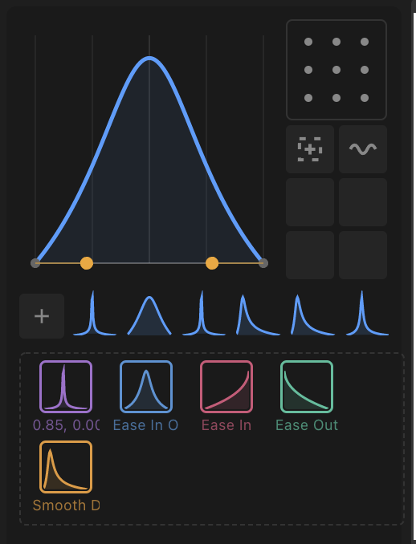

# Pendulum

A visual easing editor panel for Adobe After Effects. Shape keyframe easing by dragging curves on a speed graph instead of tweaking influence values numerically.



## Install

1. Download `com.pendulum.cep.zxp` from the [latest release](../../releases/latest).
2. Install with one of:
   - **[ZXP Installer](https://aescripts.com/learn/zxp-installer/)** (free, recommended) -- drag the `.zxp` onto the window
   - **[ExManCmd](https://github.com/nicholascapo/ExManCmd)** -- `ExManCmd /install com.pendulum.cep.zxp`
3. Relaunch After Effects.
4. Open the panel: **Window > Extensions > Pendulum**.

### Manual install (unsigned)

If you'd rather skip the ZXP installer, unzip the `.zxp` (it's a ZIP file) and copy the contents to:

| OS      | Path                                                                 |
| ------- | -------------------------------------------------------------------- |
| macOS   | `~/Library/Application Support/Adobe/CEP/extensions/com.pendulum.cep` |
| Windows | `%APPDATA%\Adobe\CEP\extensions\com.pendulum.cep`                    |

Then enable unsigned extensions by setting a registry/plist flag:

- **macOS**: `defaults write com.adobe.CSXS.11 PlayerDebugMode 1`
- **Windows**: add a string value `PlayerDebugMode` = `1` under `HKCU\Software\Adobe\CSXS.11`

Bump the CSXS version number (`.11`) to match your installed CEP version if needed. Relaunch After Effects after this change.

## Docs

The project site lives in [`site/`](site/) and is published to [alexwiench.github.io/pendulum](https://alexwiench.github.io/pendulum/) via GitHub Actions on push to `main`.

To preview locally, serve the `site/` directory with any static file server:

```bash
npx serve site
# or
cd site && python3 -m http.server 3000
```

## Development

```bash
npm install
npm run symlink   # link extension into AE's CEP folder
npm run dev        # start dev server with HMR
```

### Build

```bash
npm run build      # production build (unsigned)
npm run zxp        # signed ZXP package -> dist/zxp/
```
